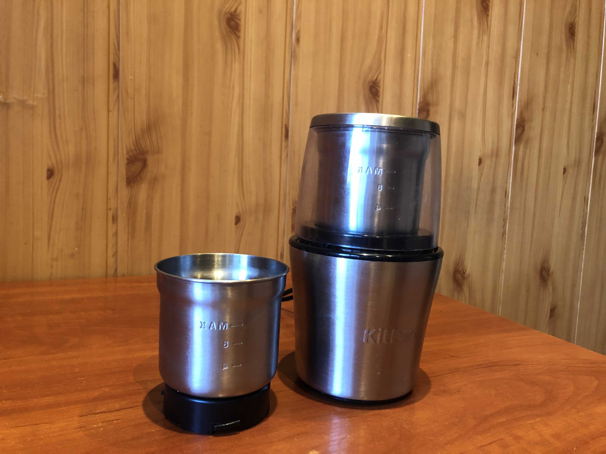

# Инструкция для работы с Markdown

## Выделение текста

Чтобы выделить тест курсивом необходимо обрамить
его звездочками (*) или знаком нижнего подчеркивания (_). Например, *Вот так* или _вот так_.

Чтобы выделить текст полужирным, необходимо обрамить
его двойными звездочками (**) или двойным знаком нижнего подчеркивания (__). **Например Вот так** или __вот так__.

Альтернитивные способы выделения текста нужны для совмещения. Например,
_текст может быть выделен курсивом и при этом быть **полужирным**_

## Списки

## Работа с изображением

Чтобы вставить изображение, нужно:

## Ссылки

## Работа с таблицами

## Цитаты

## Заключение
